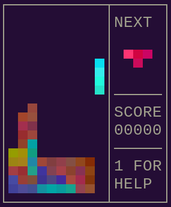

# tetra_term

Play tetris inside your terminal!



## Quick Start

If you just want to try it out run the following commands in your terminal:

```sh
curl --proto '=https' --tlsv1.2 -sSf https://sh.rustup.rs | sh
git clone https://github.com/golmman/tetra_term.git
cd tetra_term
cargo run
```

Explanation:

1. [Install Rust](https://www.rust-lang.org/tools/install)
2. Clone this repository
3. Switch directory
4. Build and run the application with Rust's package manager

## Installation

If you want to install the application, follow the
quick start description first, then:

```sh
cargo install --path .
```

This builds and copies the app to `$HOME/.cargo/bin` which is in your `PATH` if
Rust has been installed properly.

Now you can play tetris everywhere by typing `tetra_term` in your terminal.

## Controls

| Key                   | Action       |
| --------------------- | ------------ |
| `q` or `ctrl+c`       | Quit         |
| `w` or `k` or `up`    | Rotate       |
| `a` or `h` or `left`  | Move left    |
| `s` or `j` or `down`  | Move down    |
| `d` or `l` or `right` | Move right   |
| `space`               | Drop         |
| `r`                   | Restart      |
| `1`                   | Toggle Help  |
| `p`                   | Toggle Pause |
